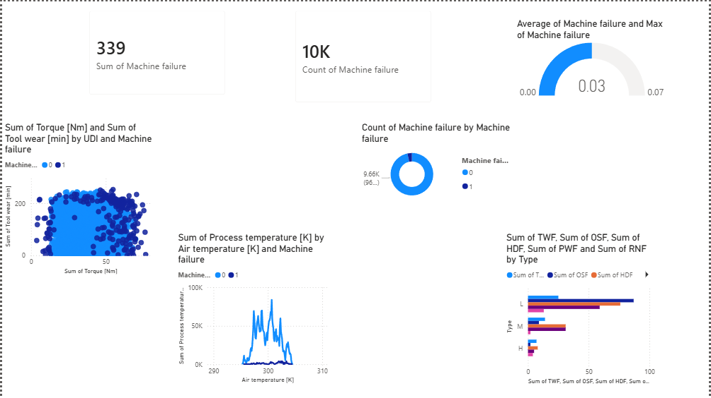

# 🔧 Predictive Maintenance Analysis

## 📌 Project Overview
An end-to-end Predictive Maintenance Analysis system using IoT sensor data
to predict machine failures before they occur using Big Data processing and
Machine Learning.

## 📊 Dataset
- **Source:** AI4I 2020 Predictive Maintenance Dataset (Kaggle)
- **Size:** 10,000 records, 14 features
- **Features:** Air temperature, Process temperature, Rotational speed,
  Torque, Tool wear, Failure types

## 🛠️ Tech Stack
- **Language:** Python 3.10+
- **Big Data:** Apache Spark (PySpark)
- **Machine Learning:** XGBoost, Random Forest, Logistic Regression
- **Explainability:** SHAP
- **Visualization:** Power BI
- **Environment:** Google Colab

## 📁 Project Structure
predictive-maintenance/
├── notebooks/
│   ├── 01_EDA.ipynb
│   ├── 02_preprocessing.ipynb
│   ├── 03_bigdata_spark.ipynb
│   ├── 04_model_training.ipynb
│   └── 05_evaluation.ipynb
├── visualizations/
│   ├── Predictive_Maintenance_Dashboard.pbix
│   └── powerbi_dashboard.png
└── data/
└── spark_processed_data.csv
## 🤖 Model Results
| Model | ROC-AUC |
|---|---|
| XGBoost | 0.9966 |
| Random Forest | 0.9927 |
| Logistic Regression | 0.9365 |

## 🔍 Key Findings
- XGBoost achieved **99.66% ROC-AUC score**
- Tool wear and Torque are the most important failure predictors
- Low quality machines (Type L) have highest failure rates
- Heat Dissipation Failure (HDF) is the most common failure type

## 📊 Power BI Dashboard

## ⚙️ How to Run
1. Clone the repository
2. Open notebooks in Google Colab
3. Run notebooks in order (01 → 05)
4. Open .pbix file in Power BI Desktop

## 👤 Author
- Name: Pon Vigneshwaran 
- Domain: Computer Science Engineering
- Tools: Python, PySpark, XGBoost, Power BI, GitHub
